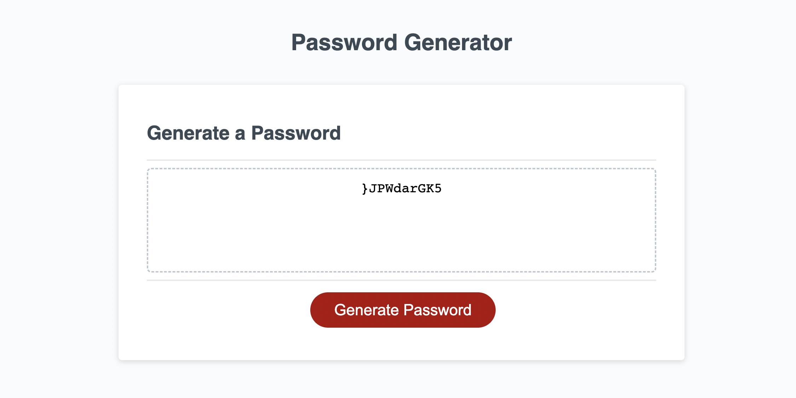

# Project Title

Module 3 Challenge

## Description

This is the third project in the University of Texas
at Austin Coding Bootcamp.  In this project, students have been
tasked with modifying code to create a password generator. The
password generator prompts users to select the number of characters
in the password (from 8 - 128), and then whether or not the password
should have lowercase letters, uppercase letters, numbers, and/or
special characters.
The code then generates the password and displays it on the screen.

## Screenshot

## Links

<a href="https://skip-thurm.github.io/module-3-challenge/">Link to Deployed Page</a>

<a href="https://github.com/skip-thurm/module-3-challenge">Link to Github Page with Code</a>

## Author

Skipper Thurman

email: slthurman01@gmail.com

<a href="https://github.com/skip-thurm">Personal Github Page</a>